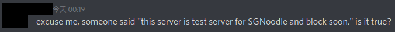

### 重要！ 不要相信謠言！！

**請不要相信謠言!!**  所有伺服(除了泰服), 包括米粉, 都是使用我們(醬燒海豹)的海豹核心, 有經過同意的服皆用"穩定測試及bug回報"的名義跟我們拿取伺服端模擬程式開服.
我們(醬燒海豹)是完整獨立的服, 有自己的開發跟維運, 不屬於任何其他服~

**No, absolutely NOT TRUE.** All servers(except thai), including `SGNoodle`, are using our (`Sauce Burn Seal`) **server side emulator** codebase;
All authorized servers using codebase for "stably test and bug report".
That means, We (`Sauce Burn Seal`) are a independent server, **NOT testing server for any other server**!

------

### 關於本服

首先，稍微講一下關於這個伺服的事，目標是創造一個對戰完善且能順打的環境，那就需要各位幫忙除錯，相信有讀表單的人都了解。

在將本服公開前我們已經除了不少於100個bug(你能想像一開始連遊戲都不能結束嗎?)，再公開後多虧了各位又讓對戰模式更加的完整。

所～以，**進入下一階段後(不是正式)，我們將會清除所有人的機庫，一切從零開始(抽機體)**，當然，會**依照現階段的參與程度提供不同的獎勵**。

下一階段主要會專注於後台及使用者介面，減少人工介入的部份，目標是自動化的帳號管理、戰績察看、天梯系統等等的功能，並**嘗試加入全新的機體(機娘?)**。

至於，洗掉機庫的時間與各機體定價/取得方法等還尚未確定，現階段參與測試的玩家會視參與程度給不同程度的獎勵/補償，確定後會再公告。

ps.洗掉機庫的主因是太多玩家不看自己機庫有哪些機體，一直問怎沒有XXX，
所以，自己取得就沒有這個煩惱了~~

------

### 人員介紹
服主 : 睡你麻痺起來嗨(醬油)
管理 : Licon(立空)
內部測試員 : 蘋果(SP DOWN)、喔勒、呆呆(兼宣傳)、餅乾(兼宣傳)及MSGO的各位

