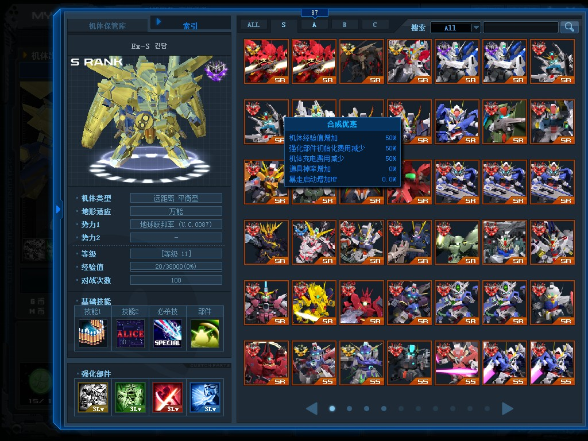

<select class="form-control lang" onchange="setLang(this)" style="display:block;position:absolute;z-index:50;right:0;width:auto;">
	<option value="">auto</option>
	<option value="zh">zh</option>
	<option value="en">en</option>
</select>

### Registration is open

New Registration method now online!
Invite your friends join together!

[Discord invite link](https://discord.gg/b2VqaNb)

### bot command generator:

#### register account  !reg:

	login account<input id="acc" onkeyup="gencmd(this)" type="text" class="form-control" placeholder="acc001" >

	login password<input id="pwd" onkeyup="gencmd(this)" type="text" class="form-control" placeholder="pwd123" >

in-game nickname<input id="nick" onkeyup="gencmd(this)" type="text" class="form-control" placeholder="MSGO-IMBA" >

register command<input id="reg" type="text" class="form-control" placeholder="!reg <acc> <pwd> <nick>" readonly><button class="btn btn-default" type="button" onclick="cp(this)">copy</button>

### What could you get if join now:

ps.**first 6 page empty** for player place their units, other units **start from page 7**~~~

