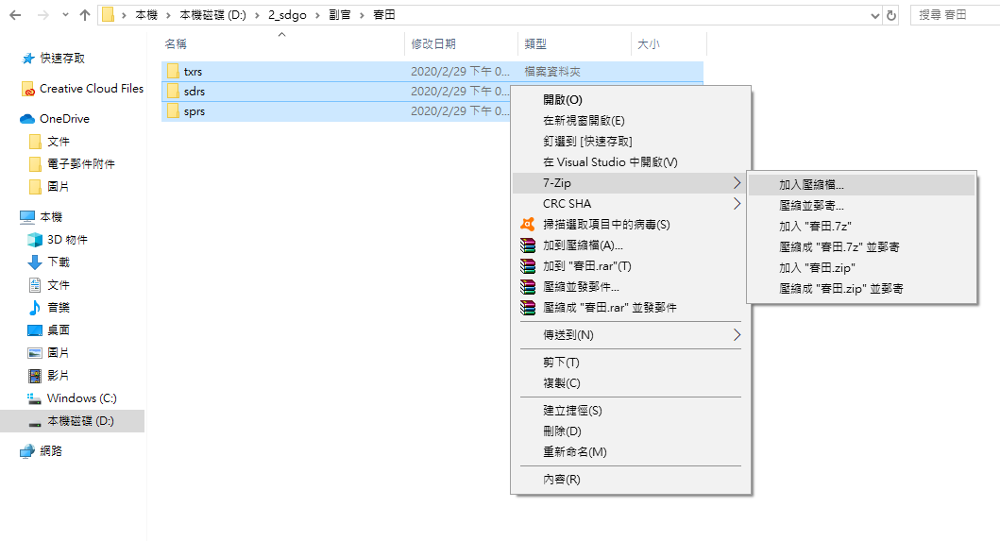
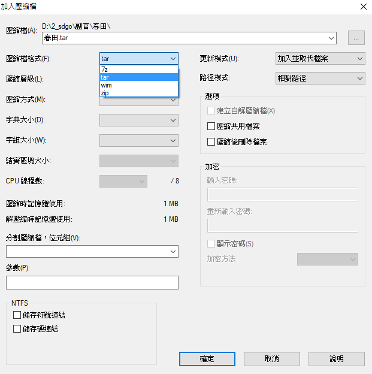
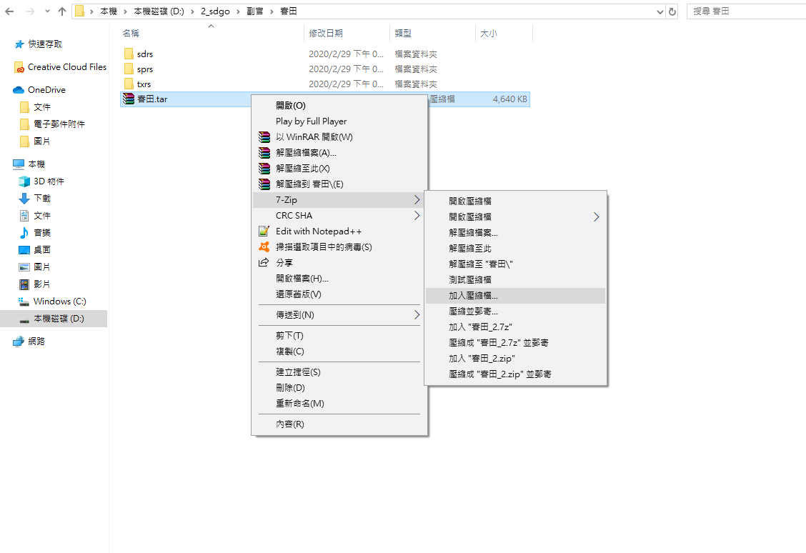
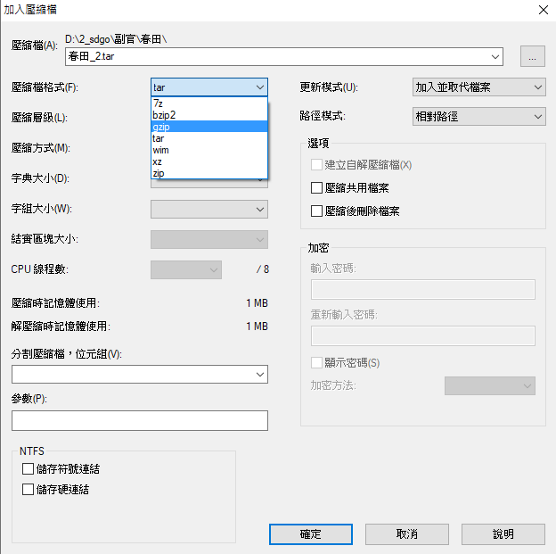
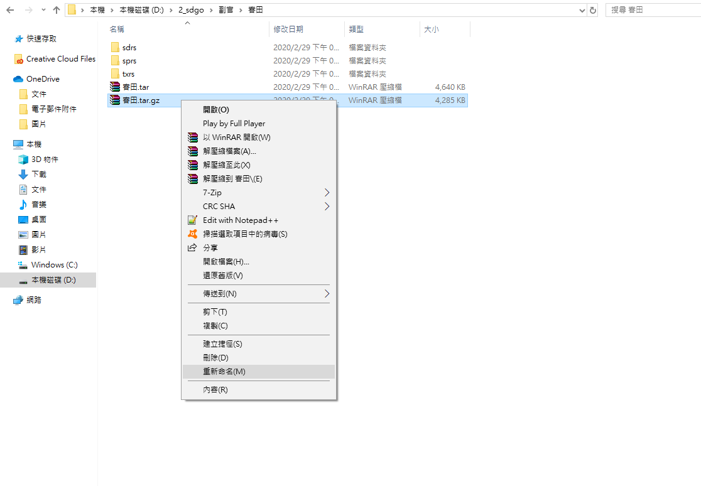
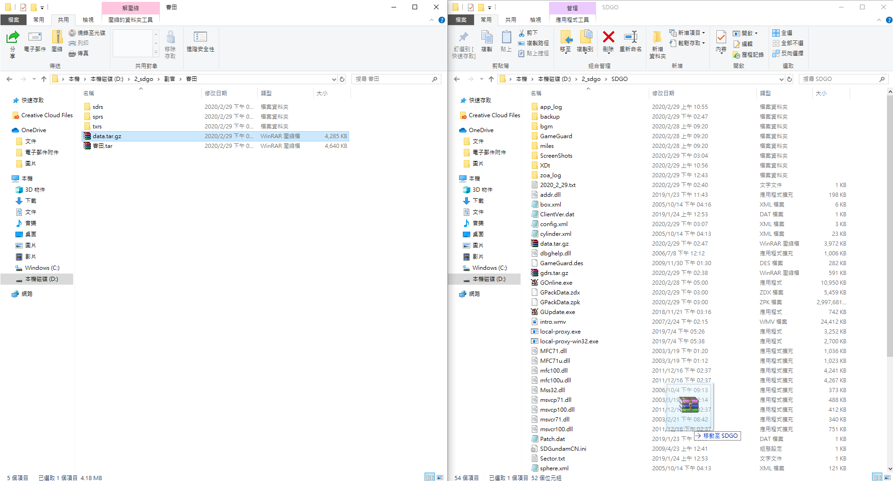
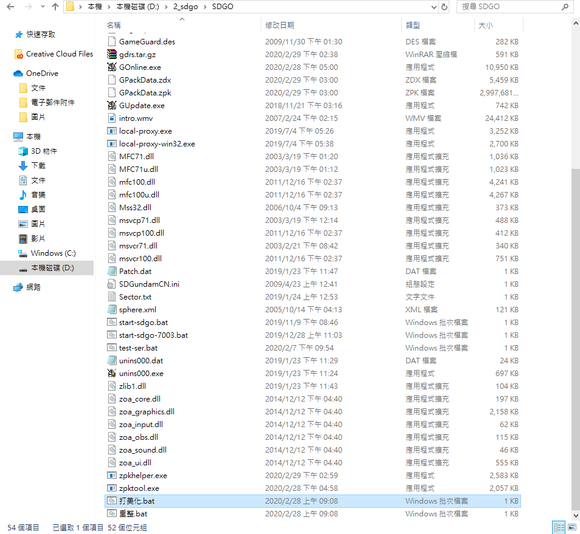
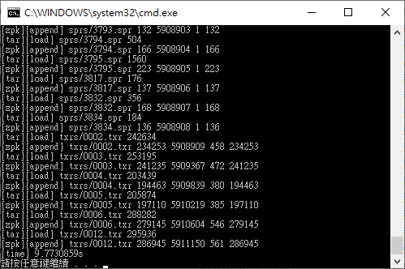
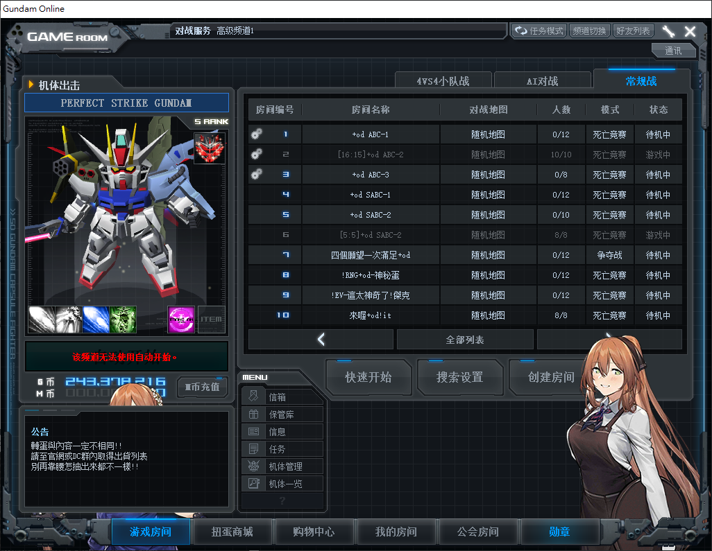

## 美化教學:

### 注意事項
* **改美化造成的問題, 請自行承擔, 別認為GM應該幫你解決到好**
* **我們只能保證群內提供的主程式能正常改, 其他來源的可能會炸**
	* `zpk`檔必須要是重統改重新封裝過的
	* 換句話說, 幻大的UOP可以打入的zpk = 不適用本服的美化工具 (至少目前是如此)
* **"`美化工具`"是"`把美化包打進遊戲裡面的工具`"**
	* **沒有內建**很多~~老婆~~副官讓你選
	* **自己的~~老婆~~副官請自己做!!**
* 美化工具請至Discord群內下載
* 美化工具只吃`.tar.gz`格式打包過的**"`原檔`"**
	* 如果是幻大UOP工具的`.hywl`或`psarc`, 請先用UOP解出原檔後重新包裝
	* 若之後有直接提取`.hywl`內容的方法會再做更新
* 要打入的zpk(很大的那個檔), 必須是傳統改重新封裝過的, 如不確定, 請用Discord群內下載的主程式來改
* 因資料不足的緣故, 目前僅能美化副官跟部份界面, 若有遺漏的檔案, 請聯絡GM並提供美化原檔方便我們修正

### 文字步驟

1. 將原檔打包成`data.tar.gz`
	* 原檔應如下方式放置:
		* `txrx/`
			* `aaaa.txr`
			* `bbbb.txr`
		* `sdrs/`
			* `xxx.zsd`
			* `yyy.zsd`
	* 併打包成單一`.tar.gz`檔案
2. 移至主程式目錄底下
	1. 有那個很大的`GPackData.zpk`的地方
	2. 美化工具也要解開放在這邊
3. 執行`打美化`
4. 等跑完
5. 開遊戲確認正常完成

### 圖片步驟:

##### 選取要打入的美化原檔

##### 包成tar

##### 壓縮成gz

##### 改名為"data.tar.gz"

##### 將"data.tar.gz"放至主程式目錄

##### 執行"打美化"

##### 等跑完

##### 開遊戲確認正常完成

